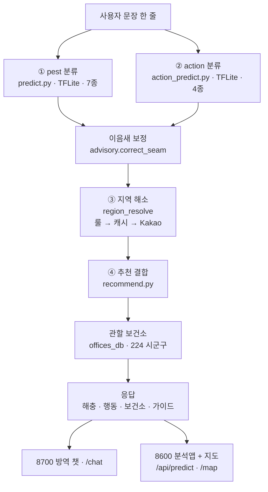

# 해충 제보 데모

한국어 SNS 제보 문장 한 줄을 입력하면 **① 무슨 해충 · ② 어떤 행동(긴급·신고·안내) · ③ 어디(관할 보건소) 연락**까지 판단해 대응 가이드와 지역 지도를 돌려주는 경량 방역 추천 데모입니다. 추론 핵심은 오프라인으로 도는 **2개의 작은 TFLite 텍스트 분류 모델**(각 ~70KB)입니다.

- 텍스트 분류: Kiwi 형태소 분석 + TensorFlow Lite (pest 7종 · action 4종)
- 방역 추천: 이음새 보정(`advisory`) + 지역 해소(룰→캐시→Kakao) + 전국 보건소 룩업(224 시군구)
- 웹 앱: Flask — **8600 분석앱+지도** · **8700 방역 챗**
- 지도: Kakao Maps JavaScript SDK
- 배포: Hugging Face Spaces Docker

## 아키텍처 / 파이프라인

문장 한 줄이 응답이 되기까지. pest·action 두 모델이 병렬로 판단하고, 이음새 보정으로 합친 뒤 지역·보건소를 붙입니다.



| 단계 | 하는 일 | 담당 |
|------|---------|------|
| ① pest | 문장 → 해충 7종(모기·바퀴·러브버그·말벌·진드기·빈대·none) | `predict.py` + tflite |
| ② action | 문장 → 행동 4종(emergency·dispatch·guide·none) | `action_predict.py` + tflite |
| 이음새 | 두 모델 판단 충돌 보정(false-none 복구 등) | `advisory.py` |
| ③ region | 문장 → 시군구 (룰→캐시→Kakao, 좌표가 진실) | `region_resolve.py` |
| ④ recommend | 해충+행동+지역 → 보건소+대응 가이드 | `recommend.py` · `offices_db.py` |

> 모델 추론은 **완전 오프라인**입니다. 처음 보는 장소의 위치 해소만 1회 온라인(Kakao)이고, 이후 `geocode.json`에 캐시돼 오프라인으로 동작합니다.

## 주요 기능

- 문장 입력 후 해충 분류: 모기, 러브버그, 말벌, 진드기, 바퀴벌레, 빈대, 해충 없음
- 해충별 위험도와 예방 가이드 표시
- 전국 가상 제보 데이터 기반 지도 마커
- 오늘, 해충 종류, 위험 높음 필터
- Hugging Face 배포 환경에서 `KAKAO_JS_KEY` 자동 주입

## 폴더 구조

```text
pest-sns/
├─ web/
│  ├─ server.py              # Flask 서버
│  ├─ templates/             # 화면 템플릿
│  ├─ static/                # CSS, JS, 지도용 JSON
│  └─ data/                  # 서버 API용 제보/좌표 JSON
├─ deploy-hf/                # Hugging Face Spaces 배포 설정
├─ train_to_tflite.py        # 모델 학습 및 TFLite 변환
├─ predict.py                # 추론 공통 모듈
├─ make_reports.py           # 가상 제보 데이터 생성기
├─ geocode.py                # Kakao REST 좌표 캐시 생성기
└─ pest_info.json            # 해충별 예방 정보
```

## 빠른 실행

가상환경은 저장소 상위의 `.venv`를 기준으로 작성되어 있습니다.

```powershell
cd C:\dev\Second-Brain-Project\Hoseo\pest-sns
..\.venv\Scripts\python.exe -m pip install -r requirements.txt flask==3.1.3
```

모델 파일이 없다면 먼저 생성합니다.

```powershell
..\.venv\Scripts\python.exe train_to_tflite.py
```

웹 서버 실행:

```powershell
$env:HOST="127.0.0.1"
$env:PORT="8600"
..\.venv\Scripts\python.exe web\server.py
```

접속:

```text
http://127.0.0.1:8600
http://127.0.0.1:8600/map
```

## Kakao 지도 키

로컬에서는 지도 화면에서 Kakao JavaScript 키를 직접 입력할 수 있습니다.

방문자가 키를 입력하지 않게 하려면 환경변수로 넣습니다.

```powershell
$env:KAKAO_JS_KEY="카카오_JavaScript_키"
..\.venv\Scripts\python.exe web\server.py
```

Kakao Developers의 JavaScript SDK 도메인에는 실제 접속 도메인을 등록해야 합니다.

```text
http://127.0.0.1:8600
http://localhost:8600
https://wlgur2101-pest-report-demo.hf.space
```

## 데이터

현재 지도 데이터는 전국 가상 제보 데이터입니다.

- `web/static/reports.json`: 브라우저 지도용 제보 데이터
- `web/static/geocode.json`: 브라우저 지도용 좌표 데이터
- `web/data/reports.json`: Flask API용 제보 데이터
- `web/data/geocode.json`: Flask API용 좌표 데이터

지도 JS는 정적 JSON 로드가 실패하면 `/api/reports` 집계 API로 대체합니다.

## 모델

`models/`는 `.gitignore` 대상입니다. 새 환경에서는 아래 명령으로 재생성합니다.

```powershell
..\.venv\Scripts\python.exe train_to_tflite.py
```

생성 파일:

```text
models/pest_text_model.tflite
models/vocab.json
models/label_map.json
```

검증:

```powershell
..\.venv\Scripts\python.exe eval_holdout.py
```

## Hugging Face 배포

먼저 Hugging Face CLI에 로그인합니다.

```powershell
..\.venv\Scripts\hf.exe auth login
```

배포:

```powershell
..\.venv\Scripts\python.exe deploy-hf\deploy.py
```

기본 Space 이름은 `pest-report-demo`입니다. 다른 이름을 쓰려면 인자로 넘깁니다.

```powershell
..\.venv\Scripts\python.exe deploy-hf\deploy.py my-space-name
```

Space Settings의 Variables and secrets에 아래 값을 추가하면 지도 키 입력 없이 동작합니다.

```text
KAKAO_JS_KEY=카카오_JavaScript_키
```

현재 배포 URL:

```text
https://huggingface.co/spaces/wlgur2101/pest-report-demo
https://wlgur2101-pest-report-demo.hf.space
```

## 문제 해결

지도 데이터가 안 보이면:

- 브라우저에서 `Ctrl + F5`로 강력 새로고침
- `/api/reports`가 200으로 응답하는지 확인
- `web/static/reports.json`, `web/static/geocode.json`이 배포에 포함됐는지 확인

Kakao 지도 SDK 로드 실패가 뜨면:

- REST 키가 아니라 JavaScript 키인지 확인
- Kakao Maps API 사용 설정이 켜져 있는지 확인
- Kakao Developers에 실제 접속 도메인이 등록되어 있는지 확인
- Hugging Face는 `https://<계정>-<space>.hf.space` 도메인을 등록
