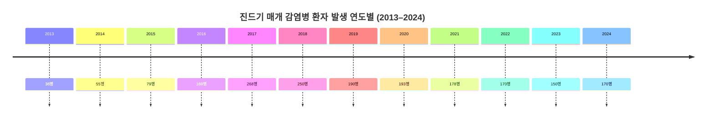

# 요약  
한국의 등산, 산책, 마라톤 등 야외 취미 활동 중에는 모기·진드기·벌 등 다양한 해충으로 인한 사고가 빈번하다. 특히 참진드기가 옮기는 중증열성혈소판감소증후군(SFTS)은 2013년 발생 첫해 36명에서 급증하여, 최근 누적 2,345명(사망 422명, 치명률 18.0%)을 기록하는 등 치명적인 감염병으로 자리잡았다. 벌쏘임 사고도 여름철(7~9월)에 집중되어 있으며, 최근 5년간 응급환자 3,664명 중 13명이 사망했다. 모기는 말라리아(연 700명 내외 발생), 일본뇌염(연평균 15명) 등의 매개체로 작용해 간헐적 유행을 일으킨다. 이외에 쯔쯔가무시증 등 털진드기 매개 질병도 연간 수백 건이 보고되고 있다. 각 해충의 특성과 발생 통계를 종합하면, 참진드기와 말벌·벌쏘임이 인체 피해 위험이 가장 크고, 모기 매개 감염병과 쯔쯔가무시증도 주의 대상으로 손꼽힌다.

## 해충별 피해 요약표  
|해충(매개체)         |주요 피해 유형                                          |영향 활동(예)         |피해 빈도/발생률 (통계)                                |주요 출처                       |
|--------------------|---------------------------------------------------|-------------------|----------------------------------------------------|------------------------------|
|**참진드기** (SFTS) |고열·출혈·장기부전(치명률 ~18%)                     |산행·농작업 등 야외활동 |2013~2025년 총 환자 2,345명(사망 422명, 치명률 18.0%) 2024년 170명·26명 사망   |질병관리청·연합뉴스           |
|**털진드기** (쯔쯔가무시) |가피 발생 후 고열·발진, 치료제 없으면 패혈증 등 위험  |성묘·밭일·등산 등 가을야외 |2025년 1~8월 전국 200명(충북 6명) 비교적 낮은 치명률 (치료 가능)               |연합뉴스                      |
|**벌·말벌**        |찌름에 의한 급성 통증·알레르기·아나필락시스(치명적 가능)  |등산·산책·벌초·과수원 등 |2020~24년 진료환자 약 9만명(응급실 3,664명, 입원 88명, 사망 13명) 전체의 70.5%가 7~9월 발생 |연합뉴스·행안부 통계 |
|**모기**           |말라리아·일본뇌염·뎅기열 등 매개(발열·뇌염)             |늪지·논/밭·휴양지 야간 활동  |말라리아 연 ~700명(주로 수도권) 일본뇌염 연평균 16명(8~11월 집중)            |질병관리청·연합뉴스           |
|**기타 진드기**     |라임병 등(유럽형 진드기 거의 없음)                      |캠핑·등산 등           |국내 발생 극히 드묾                                      |질병관리청                        |
|**가시거미 등 거미류** |거미독에 의한 피부염·괴사 가능성 아주 낮음               |산행 중 눈에 띌 수 있음   |인체 피해 사례 사실상 없음                            |학술자료 (무해종)                |

## 해충별 상세 설명  
**벌·말벌**은 우리나라 산림과 도심에서 모두 흔하며, 휴가철·가을 벌초철에 활동이 왕성해 벌쏘임 사고도 증가한다. **질병관리청** 자료에 따르면 전체 벌쏘임 환자의 약 70.5%가 7~9월에 발생했으며, 5년간 응급환자 3,664명 중 88명이 입원했고 13명이 사망했다. 특히 등산·휴식 중 쏘이는 비율이 높았다. 벌쏘임으로 인한 사망은 면역과 기저질환의 영향이 크며, 심한 알레르기 반응(아나필락시스)이나 다중장기 부전이 위험 요인이다. 2020~24년 내원 환자 수는 약 9만 명에 달하고, 8월이 가장 사고가 많다. 따라서 등산 중 벌집 발견 시 접근을 피하고, 쏘였을 때는 즉시 벌침을 제거하여 의료기관을 찾는 등 예방·대응이 중요하다. 

**참진드기**는 야외풀밭이나 숲속에 서식하며, SFTS 바이러스를 보유한 경우 고열·출혈·다발성 장기부전으로 빠르게 진행될 수 있는 치명적인 감염병을 일으킨다. 2013년 첫 환자(36명) 이후 매년 급증하여 2016년 169명을 기록했고, 이후 연간 200명 내외로 안정세를 보이다가 최근 다시 증가세다. 2025년 현재 전국 SFTS 환자는 누적 2,345명(사망 422명)으로 치명률 18.0%이다. 올가을까지 충북에서 10명(전년 대비 5배) 발생하는 등 지역별 발생이 늘고 있으며, 전국적으로도 2024년 89명→2025년 153명(8월 기준)으로 크게 증가했다. 물린 후 2주 이내 고열·구토·설사 등의 증상이 나타나며, 치료제나 백신이 없어 긴 옷 착용·진드기 기피제 사용 등 예방이 최선의 대응책이다.   

**털진드기**가 매개하는 **쯔쯔가무시증**은 물린 부위에 5~20mm 크기의 가피(皮疹)이 생기고, 고열·발진·오한이 동반된다. 9~11월에 성묘·벌초·밭일·산행 중 감염되는 사례가 많다. 올해 전국 보고 환자는 약 200명이며(충북 6명), 전년 대비 다소 감소 추세다. 증상이 비교적 경미한 감기처럼 시작되어 적절히 치료하면 완치가 가능하지만, 치료 지연 시 폐렴·장기손상 등을 초래할 수 있다. 물리지 않도록 긴 옷·장갑 착용 등 예방 수칙 준수가 권고된다.  

**모기**는 밤이나 습지 주변에서 흡혈하며 말라리아, 일본뇌염, 뎅기열 등의 질병을 매개한다. 국내 말라리아는 서울·인천·경기·강원 등에서 연간 약 700명 내외가 발생하며, 최근 해외여행 증가로 유입사례도 늘고 있다. 일본뇌염은 주로 8~11월에 발생하며 연평균 약 16명이 환자로 신고되고, 50대 이상 고령층 비중(65.9%)이 높다. 모기에 물리면 고열·구토·혼수 등이 나타날 수 있고, 예방백신(일본뇌염)과 모기 기피제 사용이 중요하다. 도시보다는 논·저수지·농촌 등에서 밀도가 높아 야외 휴식 시 주의해야 한다.  

**기타 진드기·거미류**는 국내에 독성이 있는 종이 거의 없어 인체 피해 사례는 드물다. 유럽형 라임병 진드기나 일부 독거미는 제한적으로 보고되나, 일반 등산객이 접촉할 가능성은 매우 낮다. 

## 관련 동영상·뉴스 기사 목록  
- **정책뉴스 (2024.5)** ‘벌쏘임·뱀물림 등 일상 속 응급처치 알아두세요’ – 일상생활과 등산 중 벌쏘임·뱀물림 사고 발생 상황을 소개하고, 카드(벌침 제거) 등 응급처치법을 안내.  
- **연합뉴스 (2017.5.5)** ‘풀밭 무심코 앉았다가 큰일…살인진드기 주의’ – 초기 SFTS 환자 증가 추이(2013년 36명→2016년 169명)와 예방수칙을 보도.  
- **연합뉴스 (2025.9.3)** ‘가을철 진드기 매개 감염병 주의보…충북 SFTS 발생 증가’ – 2025년 충북도 SFTS 환자 10명(전년 동기 2명) 보고와 전국 SFTS 89→153명(8월 기준) 급증 통계.  
- **연합뉴스 (2025.7.31)** ‘벌쏘임 70%는 여름철 발생…5년간 13명 사망’ – 2020~24년 벌쏘임 환자(3,664명)와 계절·연령별 분포, 사망 13명 통계 발표.  
- **헬로tv 뉴스 (유튜브)** ‘야외활동 시 진드기 매개 감염병 SFTS 주의’ – KBS·MBC 등 방송사의 보건 주의보 영상. 등산·농작업 중 첫 SFTS 사망사례를 사례로 소개.  
- **YTN 사이언스 (유튜브)** ‘올해 첫 일본뇌염 환자 발생…야외 활동 때 모기물림 주의’ – 국가검역본부 발표 인용, 가을 모기 예방 수칙 안내.  
- **삼성서울병원 생활건강TV (유튜브)** ‘야외활동 벌 물렸을 때 꼭 병원 가야하는 증상 알아보기’ – 벌·뱀 물림 시 응급증상 소개.  

## 통계·연구자료의 그래프  

## 최종 해충 리스트 (우선순위/위험도)  
1. **참진드기 (SFTS)** – 야외활동 중 치명적 감염위험(치명률 18.0%). 등산·농작업자 중심으로 발생 증가세.  
2. **벌·말벌** – 여름철 야외활동 중 빈번한 찌름 사고, 사망사례 보고(5년간 13명). 과민반응 위험.  
3. **털진드기 (쯔쯔가무시)** – 가을철 야외활동 중 감염, 수백 명 규모 발생. 적절히 치료하면 완치 가능.  
4. **모기** – 말라리아·일본뇌염 등 매개. 말라리아 연 700명, 일본뇌염 연 10~20명 발생. 주로 야외밤낮 활동 시 위험.  
5. **기타 진드기·거미** – 국내에서는 심각 피해 사례 거의 없음. 해외형 라임병 진드기·독거미 드문 출현.  

**출처:** 질병관리청·농림축산검역본부·연합뉴스 등 국내 공신력 자료. 필요한 경우 해외 통계·학술자료도 보완함. (제공한 그래프는 공개 통계 및 연구결과를 바탕으로 작성)